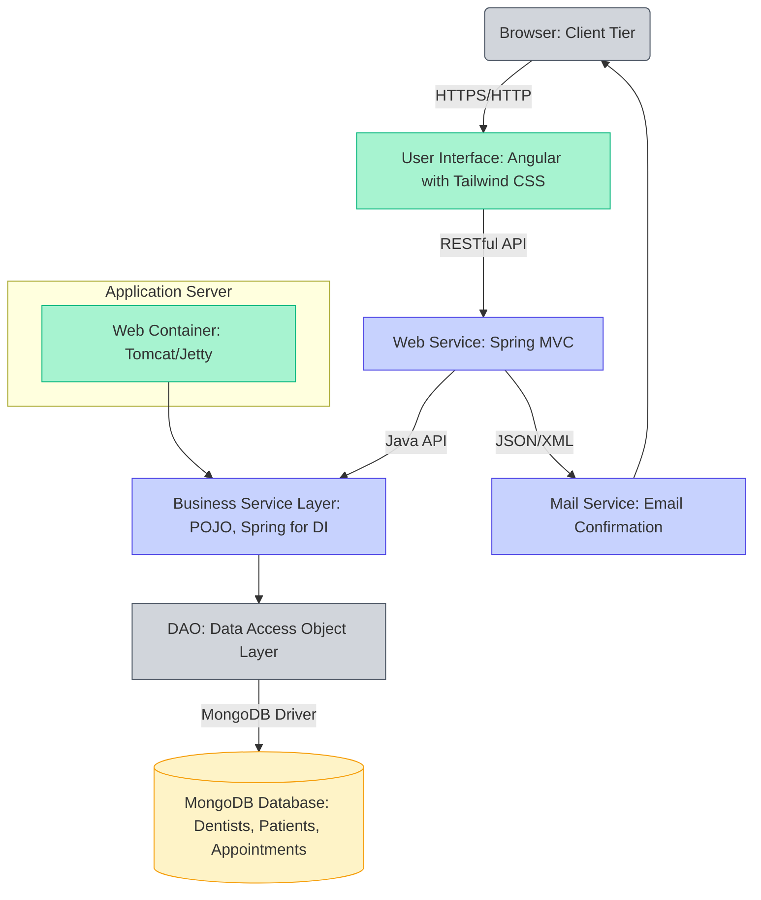

```mermaid

graph TB
  browser(Browser: Client Tier) --> |HTTPS/HTTP| ui[User Interface: Angular with Tailwind CSS]

  ui --> |RESTful API| webService[Web Service: Spring MVC]

  webService --> |Java API| bsLayer[Business Service Layer: POJO, Spring for DI]

  bsLayer --> dao[DAO: Data Access Object Layer]
  dao --> |MongoDB Driver| mongo[(MongoDB Database: Dentists, Patients, Appointments)]

  webService --> |JSON/XML| mailService[Mail Service: Email Confirmation]
  mailService --> browser

  subgraph Application Server
    webContainer[Web Container: Tomcat/Jetty]
  end

  webContainer --> bsLayer

  classDef default fill:#d1d5db,stroke:#4b5563,stroke-width:1px;
  classDef database fill:#fef3c7,stroke:#f59e0b,stroke-width:1px;
  classDef service fill:#c7d2fe,stroke:#4f46e5,stroke-width:1px;
  classDef ui fill:#a7f3d0,stroke:#10b981,stroke-width:1px;

  class mongo database;
  class mailService,webService,bsLayer service;
  class ui,webContainer ui;


```
